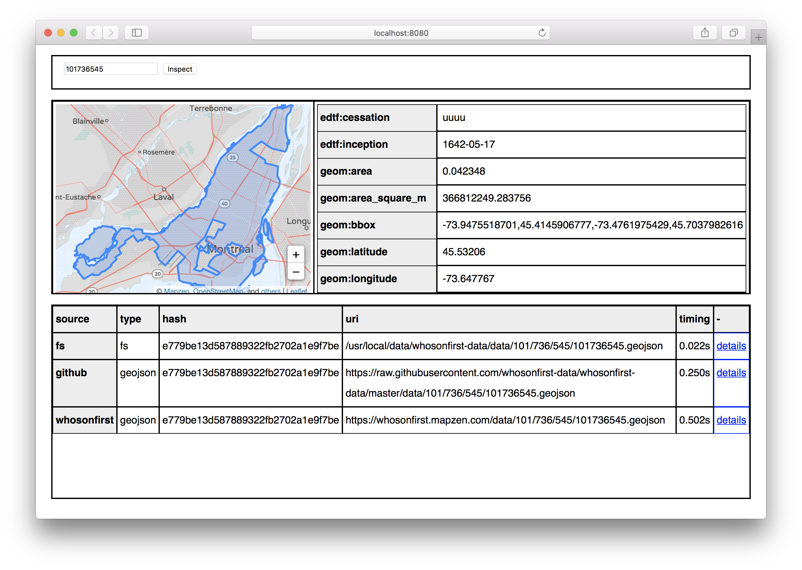
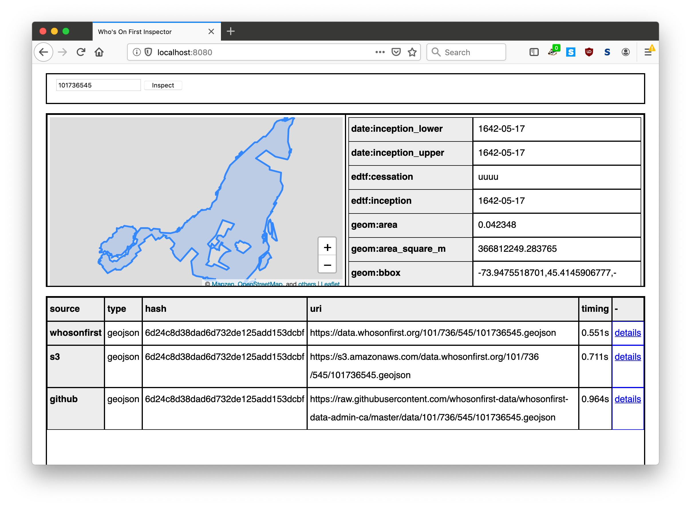

# go-whosonfirst-inspector

Who's On First datastore inspector.

## Install

You will need to have both `Go` (specifically a version of Go more recent than 1.7 so let's just assume you need [Go 1.9](https://golang.org/dl/) or higher) and the `make` programs installed on your computer. Assuming you do just type:

```
make bin
```

All of this package's dependencies are bundled with the code in the `vendor` directory.

## Important

This works but still has a bunch of old Mapzen-isms baked in to it (like map tiles) so those things... don't work.

## Usage

_Please write me_

## Tools

### wof-inspector

```
./bin/wof-inspector -h
Usage of ./bin/wof-inspector:
  -es value
    	The endpoint of an Elasticsearch database to inspect. Endpoints are defined as HOST + ':' + PORT + '#' + INDEX
  -fs value
    	The path of a Who's On First data directory to inspect. Paths are defined as ROOT + '#' + COMMA-SEPARATED LIST OF REPOSITORIES. If the value of list of repositories is '*' then all the repos in the 'whosonfirst-data' origanization will be used.
  -gh value
    	The name of a GitHub repos to inspect. If '*' then all the repos in the 'whosonfirst-data' organization will be used.
  -pg value
    	The DSN of a PostgreSQL endpoint to inspect.
  -s3 value
    	The name of an AWS S3 buckets to inspect.
  -t38 value
    	The endpoint of a Tile38 endpoints to inspect. Endpoints are defined as HOST + ':' + PORT + '#' + COMMA-SEPARATED LIST OF REPOSITORIES. If the value of list of repositories is '*' then all the repos in the 'whosonfirst-data' origanization will be used.
  -wof
    	Inspect records hosted on whosonfirst.mapzen.com/data.
```

For example:

```
./bin/wof-inspector -wof 101736545 | python -mjson.tool
{
    "101736545": {
        "recordset": {
            "records": [
                {
                    "body": {
                        "bbox": [
                            -73.9475518701442,
                            45.41459067767231,
                            -73.47619754286481,
                            45.70379826163911
                        ],

                            "wof:population_rank": 12,
                            "wof:repo": "whosonfirst-data",
                            "wof:scale": "1",
                            "wof:superseded_by": [],
                            "wof:supersedes": [],
                            "wof:tags": []
                        },
                        "type": "Feature"
			...more stuff here
                    },
                    "hash": "e779be13d587889322fb2702a1e9f7be",
                    "id": 101736545,
                    "source": "whosonfirst",
                    "timing": 715966842,
                    "type": "geojson",
                    "uri": "https://whosonfirst.mapzen.com/data/101/736/545/101736545.geojson"
                }
            ]
        },
        "timings": 725273569
    }
}
```

### wof-inspectord

```
./bin/wof-inspectord -h
Usage of ./bin/wof-inspectord:
  -api-key string
    	A valid Mapzen API key (necessary for displaying maps). (default "mapzen-xxxxxxx")
  -es value
    	The endpoint of an Elasticsearch database to inspect. Endpoints are defined as HOST + ':' + PORT + '#' + INDEX
  -fs value
    	The path of a Who's On First data directory to inspect. Paths are defined as ROOT + '#' + COMMA-SEPARATED LIST OF REPOSITORIES. If the value of list of repositories is '*' then all the repos in the 'whosonfirst-data' origanization will be used.
  -gh value
    	The name of a GitHub repos to inspect. If '*' then all the repos in the 'whosonfirst-data' organization will be used.
  -host string
    	The hostname to listen for requests on. (default "localhost")
  -local string
    	The path to a local directory containing HTML (and CSS/Javascript) assets that the wof-inspectord daemon should serve.
  -pg value
    	The DSN of a PostgreSQL endpoint to inspect.
  -port int
    	The port number to listen for requests on. (default 8080)
  -root string
    	The root path to host the wof-inspectord daemon on. (default "/")
  -s3 value
    	The name of an AWS S3 buckets to inspect.
  -t38 value
    	The endpoint of a Tile38 endpoints to inspect. Endpoints are defined as HOST + ':' + PORT + '#' + COMMA-SEPARATED LIST OF REPOSITORIES. If the value of list of repositories is '*' then all the repos in the 'whosonfirst-data' origanization will be used.
  -wof
    	Inspect records hosted on whosonfirst.mapzen.com/data.
```

For example:

```
./bin/wof-inspectord -wof -gh '*' -api-key mapzen-xxxxxx -fs /usr/local/data#whosonfirst-data
15:54:01.191421 [wof-inspectord] STATUS configure /javascript/mapzen.min.js handler
15:54:01.191577 [wof-inspectord] STATUS configure /javascript/tangram.min.js handler
15:54:01.191583 [wof-inspectord] STATUS configure /css/mapzen.js.css handler
15:54:01.191587 [wof-inspectord] STATUS configure /tangram/refill-style.zip handler
15:54:01.191591 [wof-inspectord] STATUS configure / handler
15:54:01.191599 [wof-inspectord] STATUS configure /id/ handler
15:54:01.191605 [wof-inspectord] STATUS configure /ping/ handler
15:54:01.191617 [wof-inspectord] STATUS listening on localhost:8080
```

And then if you inspected ID `101736545` you'd see something like this:



_Note: The UI/UX of `wof-inspectord` is in its very early days. Some things it doesn't do well and some things it can't do at all, yet._

But actually as of this writing what you'd really see is something like this:

```
./bin/wof-inspectord -gh whosonfirst-data-admin-ca -s3 data.whosonfirst.org
08:11:16.981933 [wof-inspectord] STATUS configure /id/ handler
08:11:16.982089 [wof-inspectord] STATUS configure /ping/ handler
08:11:16.982104 [wof-inspectord] STATUS configure /javascript/mapzen.min.js handler
08:11:16.982109 [wof-inspectord] STATUS configure /javascript/tangram.min.js handler
08:11:16.982114 [wof-inspectord] STATUS configure /css/mapzen.js.css handler
08:11:16.982119 [wof-inspectord] STATUS configure /tangram/refill-style.zip handler
08:11:16.982123 [wof-inspectord] STATUS configure / handler
08:11:16.982130 [wof-inspectord] STATUS listening on localhost:8080
```

And then:



The missing map tiles is because of all the old Mapzen assumptions that haven't been updated yet. They will be but not today.
